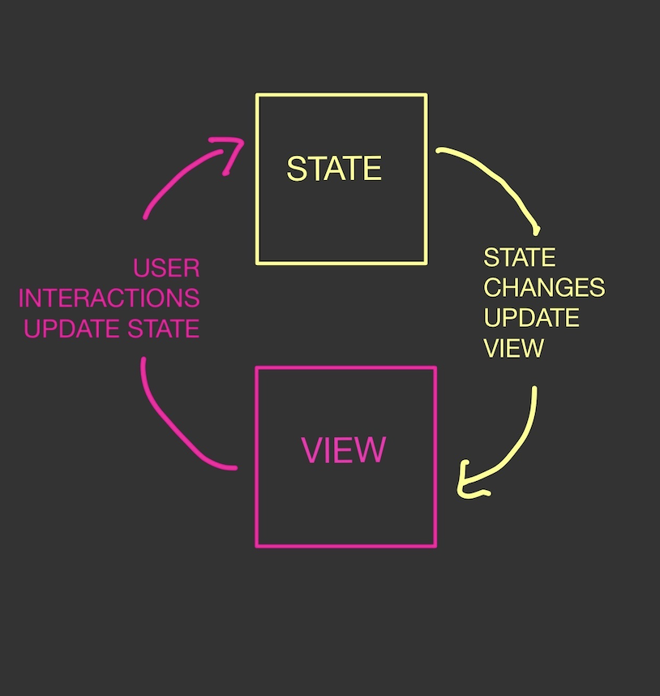

## Wiggle

- W: We always just
- I: `import`
- G: Grab DOM elements
- G: with `getElementById()`
- L: `let` state
- E: and describe our events

## What is State



- State is information that changes over time normally in response to user's interacting with our app
- We listen for events from the user to know when to update the state
- Every time state changes, update the DOM to show the user what the new state is.
- In plain JS, state is usually stored in `let` variables.
  - Why do you think that is?

```js
let counter = 0;

counter++;
```

## Event Listeners and other DOM Methods

When we write Javascript for the browser, we get access to a ton of built in methods that allows us to interact with our HTML. The ones we'll use the most often in this course are:

- `document.getElementById` - allows us to access individual elements using their `id` attribute
- `document.querySelector` - allows us to access elements by a CSS selector
- `addEventListener` - allows us to "listen" for events on individual elements

```js
const button = document.getElementById("button");
const nameInput = document.getElementById("name");
const characterName = document.getElementById("character-name");
const countDiv = document.getElementById("count");

let timesClicked = 0;

button.addEventListener("click", () => {
  const name = nameInput.value;

  timesClicked++;

  characterName.textContent = name;
  countDiv.textContent = timesClicked;
});
```

## Random numbers

- `Math.random()` returns a random number between 0 and 1
- To generate random integers, we multiply it by the highest number we want (n) and either round up or round down
- Rounding down would generate a number between 0 and n-1
- Rounding up would generate a number between 1 and n

```js
// get a random number between 1 and 10
const randomNumber1 = Math.ceil(Math.random() * 10);
// get a random number between 0 and 9
const randomNumber2 = Math.floor(Math.random() * 10);

// you could use this random number as an array index. Why would we want to do that?
myArray[randomNumber];
```

### Vocabulary

| Term                         | Definition                                                                                                  |
| ---------------------------- | ----------------------------------------------------------------------------------------------------------- |
| State                        | Data that changes over time                                                                                 |
| View                         | What our user sees on the browser                                                                           |
| UI / UX                      | User Interface / User Experience                                                                            |
| DOM                          | "Document Object Model" - the interface that our browser uses for interacting with the HTML we have written |
| DOM Methods or DOM Functions | Built in functions that we can call to allow us to interact with our HTML document                          |
