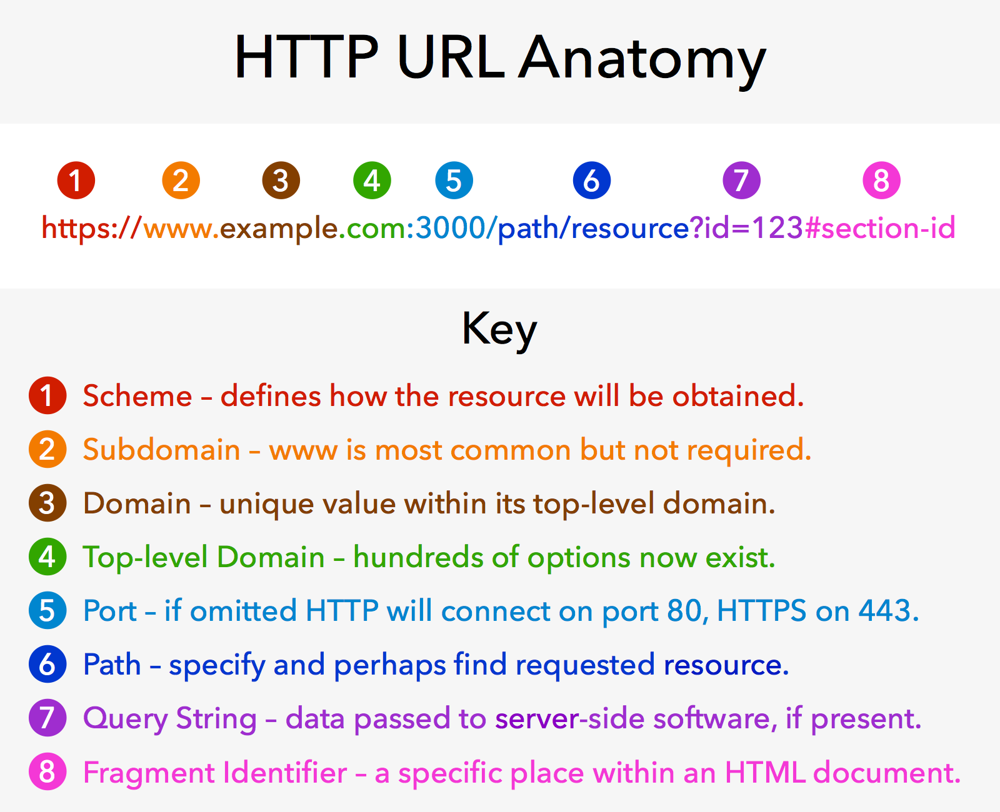

# Multi-Page Apps & URL Search Parameters

## Adding New Pages

Up until now, all of our pages have only used a single page and changed out information on the page using Javascript. For a number of reasons including usability and search engine optimization, it can be necessary to split out application into multiple pages.

When we split up our pages, we'll want to think about how best to design the "paths" associated with our application. Web applications are similar to the folder structure on your computer and we separate different pages using a "/". A URL is made up of the following structure


Source: https://pzwiki.wdka.nl/mediadesign/Universal_Resource_Locator

By using Netlify, we are given a domain for free so the first 5 pieces of our URL are given to us. This is the "address" for our application on the internet. The path, query string and fragment identifier are all things we can control in our application.

To add a new page or path to our site, we need to add a new folder in our repository. Inside that folder, we need to add an `index.html` file as well as a javascript file for any javascript we want to attach to the page. We have actually seen this pattern in our apps before - can you think where?

The following is an example of adding a new path at `/zodiac` to our application


## Query Strings or URL Search Parameters

The 7th piece of the URL anatomy shown above is a query string, also known as URL Search Parameters. These are separated from the main URL using a question mark, and then can be seen as key-value pairs separated by an equals sign. Modern browsers have a handle utility for creating these strings.

```js
const params = new URLSearchParams();
params.set("id", 123);
console.log(params.toString()); // id=123
```

We can also take a query string from the url, and pass it into the `URLSearchParams` class to create an object that makes these values easier to work with

```js
console.log(window.location.search); //?id=123
const params = new URLSearchParams(window.location.serach);
console.log(params.get("id")); // 123
```

## Benefits of Query Strings

The benefits of using query strings is they allow us to pass additional information to our application but display the same page. All of these urls would display the zodiac index.html

```
https://localhost:3000/zodiac?id=123
https://localhost:3000/zodiac?name=julie
https://localhost:3000/zodiac?id=123&name=julie
```

We could use the query parameters to display different information but at the same path.
