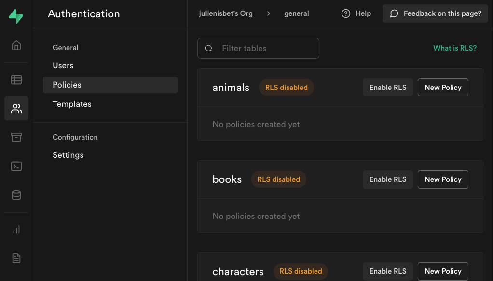
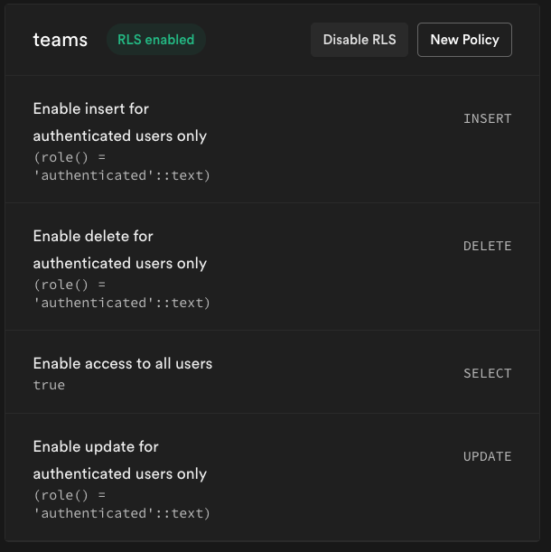

# Supabase Policies and Row Level Security

Up until now, our database has been wide open. Anyone with access to our URL / Key (which are not hidden) could read, add, update or delete rows. This is obviously not something we would want because a bad actor could easily destroy all of our data. To lock things down, we use something called `Row Level Security`. Row level security allows us to set up policies which are really just SQL queries which check that certain conditions are true, in order to perform operations on a database. 

To enable row level security on one of your tables, click on the "Policies" tab of the "Authentication" section of your Supabase project.

After RLS is enabled, your data is locked down until you enable policies. Policies are setup for each of the operations you can perform on your database: INSERT, DELETE, SELECT and UPDATE. 

The above policies only allow authenticated users to insert, delete and update rows in our database. It enables read access (or select access) to all users. 