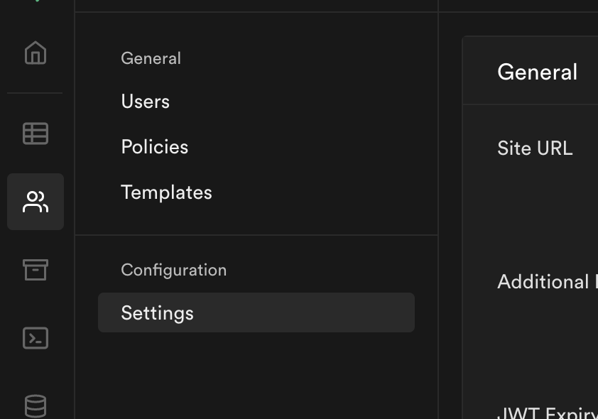
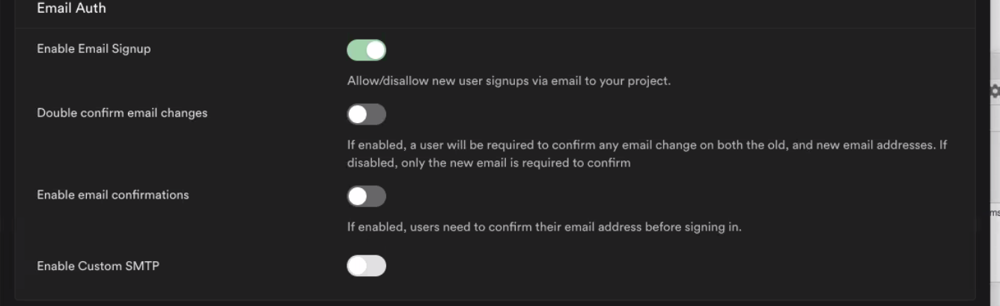

# Supabase Authentication

One of the main benefits of Supabase is how easy it is to setup Authentication. All Supabase projects include a `users` table. We will be using email authentication to enable users to register for our application. 

## Email Gotcha!
By default, Supabase wants you to use real email addresses and verify those email addresses. This is a really helpful feature when you are live and ready for production but during the testing phase is annoying to say the least. 

To disable this behavior, click on the people icon in Supabase, then go to settings, and disable the toggle.



## User Authentication Functions
```js
// when a user tries to visit a page that calls this function, we automatically redirect the user back to the login page if they are not logged in
export function checkAuth() {
    const user = getUser();

    if (!user) location.replace('../'); 
}

// when a user tries to visit a page that calls this function, we automatically redirect the user away from the login page if they are already logged in
export async function redirectIfLoggedIn() {
    if (getUser()) {
        location.replace('./some-other-page');
    }
}

// signs an new user in and puts an auth token in local storage in the browser
export async function signupUser(email, password){
    const response = await client.auth.signUp({ email, password });
    
    return response.user;
}

// signs an existing user in and puts an auth token in local storage in the browser
export async function signInUser(email, password){
    const response = await client.auth.signIn({ email, password });

    return response.user;
}

// removes the token from local storage and redirects the user home
export async function logout() {
    await client.auth.signOut();

    return window.location.href = '../';
}

// alerts the user if there is an error with their supabase call
function checkError({ data, error }) {
    return error ? console.error(error) : data;
}
```
