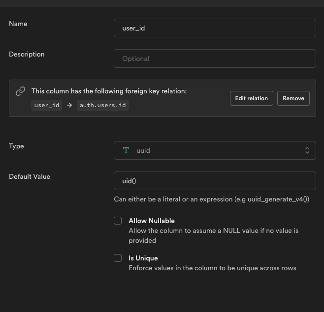

# User Data in Supabase

For the next few deliverables we will be creating user specific data in Supabase. This requires that we set up columns and policies to ensure that users can only interact with their own data.

## Foreign Keys

Foreign keys in SQL are references to another table's primary key. When tables have a foreign key, we say they "belong to" another table. The opposite relation is called a "has many". For example, if we have an authors table, and a blogs table. The author "has many" blogs (because they are able to author many blogs). Each blog "belongs to" and author.

We are going to be building out tables that "belong to" our users table. Remember in Supabase we get our user table for free so all we'll need to do is make sure we set up a `user_id` column in our associated table.

Note the use of a default value - this automatically sets the column's user_id to the authenticated user.
